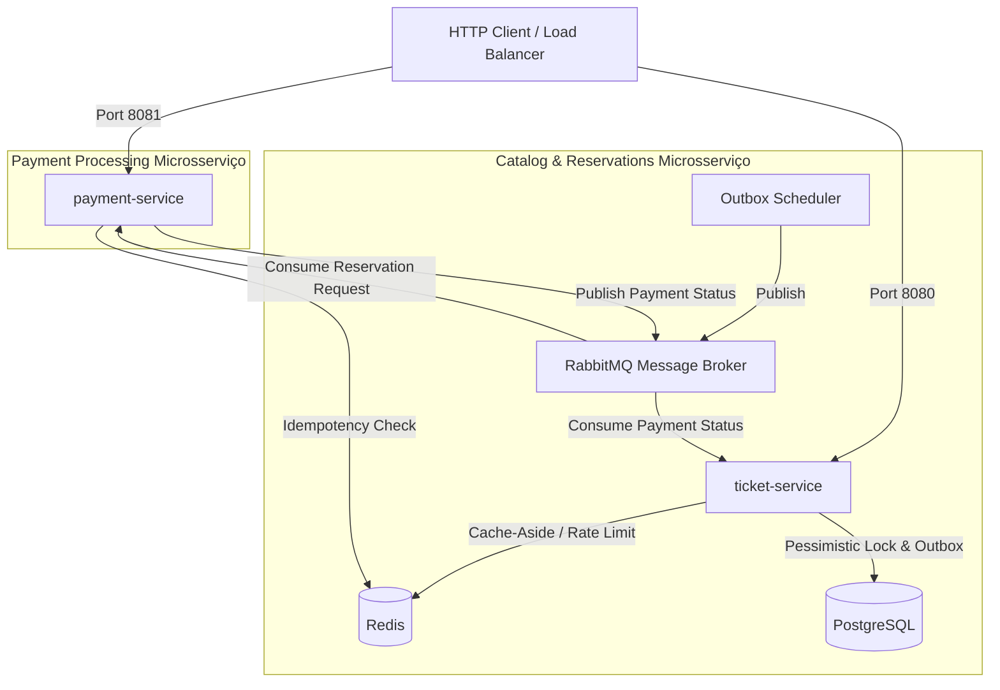
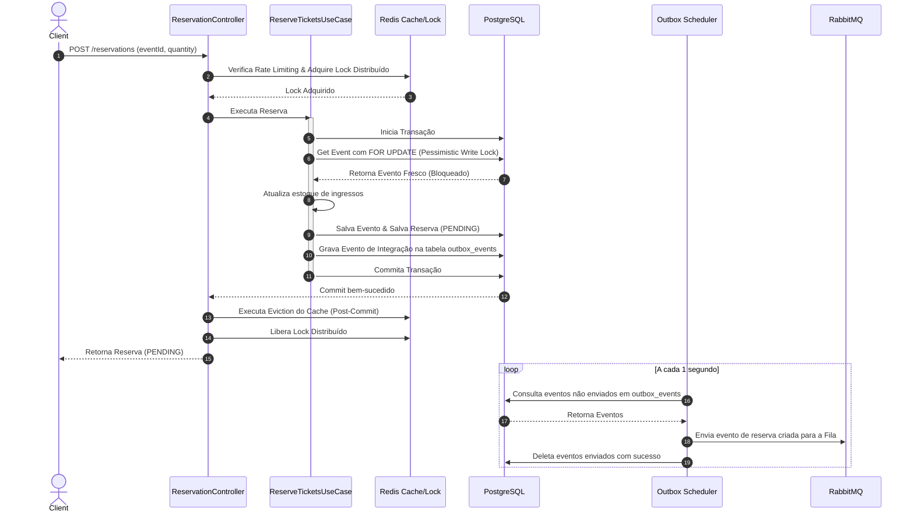

# TicketPass API 🎫


A TicketPass API é uma plataforma de venda de ingressos altamente resiliente, escalável e de alto desempenho, projetada para suportar picos extremos de tráfego (como abertura de vendas para grandes shows). 

O sistema é construído utilizando os conceitos de **Clean Architecture**, **Domain-Driven Design (DDD)**, concorrência otimizada por **Virtual Threads** e consistência transacional via **Transactional Outbox Pattern**.

---

## 🏗️ Desenho de Arquitetura

O sistema é composto por dois microsserviços principais orquestrados via Docker Compose, utilizando PostgreSQL, Redis e RabbitMQ.



### Fluxo de Reserva & Transação (Outbox + Pessimistic Lock)

Para garantir consistência absoluta sob carga extrema, o sistema combina fechamento de banco de dados (`SELECT ... FOR UPDATE`), limpeza de cache pós-commit e salvamento local de eventos na mesma transação da reserva.



---

## 🛠️ Tecnologias Utilizadas

- **Core**: Java 21 & Spring Boot 3.3.2
- **Banco de Dados**: PostgreSQL (Persistência) & Redis (Cache, Lock Distribuído, Rate Limiting, Idempotência)
- **Mensageria**: RabbitMQ (Fila assíncrona)
- **Desempenho**: Java 21 **Virtual Threads** habilitado (`spring.threads.virtual.enabled=true`)
- **Containers**: Docker & Docker Compose para orquestração

---

## 📦 Estrutura do Projeto (Clean Architecture / DDD)

Ambos os microsserviços seguem a separação estrita de camadas focando no domínio:

```text
src/main/java/com/ticketpass/ticketservice/
│
├── domain/                      # Camada de Domínio (Sem acoplamento com Frameworks)
│   ├── model/                   # Entidades de Domínio (Event, Reservation)
│   ├── exception/               # Exceções de Domínio (InsufficientTicketsException)
│   └── repository/              # Portas de Repositório (Interfaces)
│
├── application/                 # Camada de Aplicação (Casos de Uso)
│   ├── usecase/                 # Implementação de Casos de Uso (ReserveTicketsUseCase)
│   └── port/                    # Portas de entrada/saída de mensageria
│
├── infrastructure/              # Camada de Infraestrutura (Adapters externos)
│   ├── persistence/             # JPA Entities, Repositories e Cache-Aside
│   ├── messaging/               # Configuração RabbitMQ e Adapters (Publisher/Consumers)
│   ├── lock/                    # Implementação de Lock Distribuído via Redis
│   ├── security/                # Rate Limiting Interceptor
│   └── scheduler/               # Limpeza de reservas expiradas e Outbox Publisher
│
└── interfaces/                  # Camada de Apresentação (REST Controllers e DTOs)
    └── rest/                    # Controladores e Exception Handler Global
```

---

## 🚀 Como Executar o Projeto

Certifique-se de ter o Docker e Docker Compose instalados.

1. Navegue até a pasta raiz do projeto (`TicketPassAPI`).
2. Execute o comando de compilação e inicialização:
   ```bash
   docker-compose up --build -d
   ```
3. O projeto compilará os códigos internamente usando Docker Multi-Stage Builds e iniciará os seguintes serviços:
   - `ticket-service`: Rodando na porta `8080`
   - `payment-service`: Rodando na porta `8081`
   - `PostgreSQL`: Porta `5432`
   - `Redis`: Porta `6379`
   - `RabbitMQ`: Porta `5672` (Painel Web em `http://localhost:15672` com user/pass `guest`/`guest`)

---

## 📑 Documentação e Saúde da API (Padrões de Produção)

- **Swagger UI**: A documentação interativa da API está disponível em `http://localhost:8080/swagger-ui.html`.
- **Spring Boot Actuator**:
  - Health Check: `http://localhost:8080/actuator/health` (e `http://localhost:8081/actuator/health` no payment-service).
  - Info: `http://localhost:8080/actuator/info`.

---

## 🧪 Testes e Validação de Funcionalidades

As rotas protegidas exigem autenticação via **JSON Web Tokens (JWT)**. Para testar o fluxo completo, siga o passo a passo de autenticação e requisições abaixo:

---

### 1. Autenticação e Login

#### Passo A: Obter o Token JWT do Administrador
A migração inicial insere o administrador padrão (`admin@ticketpass.com` / `admin123` com perfil `ROLE_ADMIN`):

```bash
curl -s -X POST http://localhost:8080/auth/login \
  -H "Content-Type: application/json" \
  -d '{"email": "admin@ticketpass.com", "password": "admin123"}'
```
*Resposta:* Retorna um JSON contendo a propriedade `"token": "eyJhbGciOi..."`. Copie este valor de token para usar nas próximas requisições administrativas.

---

### 2. Gerenciamento de Usuários (Clientes e Cadastro)

#### Passo A: Cadastrar um Novo Cliente (Rota Pública)
Novos clientes podem se cadastrar definindo nome, e-mail e uma senha (mínimo de 6 caracteres):

```bash
curl -s -X POST http://localhost:8080/users \
  -H "Content-Type: application/json" \
  -d '{"name": "Pedro", "email": "pedro@example.com", "password": "pedropassword"}'
```

#### Passo B: Login do Cliente
Obtenha o token do cliente para simular compras e buscas:

```bash
curl -s -X POST http://localhost:8080/auth/login \
  -H "Content-Type: application/json" \
  -d '{"email": "pedro@example.com", "password": "pedropassword"}'
```
*Resposta:* Retorna o token com perfil `ROLE_USER` (vincule este token às compras e consultas do cliente).

#### Passo C: Listar todos os Usuários (Exige ROLE_ADMIN)
Envie o token do administrador para listar todos os cadastros:

```bash
curl -s http://localhost:8080/users \
  -H "Authorization: Bearer <TOKEN_DO_ADMIN>"
```

---

### 3. Fluxo de Eventos e Compras de Ingressos

#### Passo A: Criar um Evento (Exige ROLE_ADMIN)
Crie um evento enviando os dados do evento e o token do administrador:

```bash
curl -s -X POST http://localhost:8080/events \
  -H "Authorization: Bearer <TOKEN_DO_ADMIN>" \
  -H "Content-Type: application/json" \
  -d '{"name": "Rock in Rio 2026", "description": "Festival", "dateTime": "2026-09-12T16:00:00", "location": "Rio de Janeiro", "totalTickets": 100, "price": 150.00}'
```

#### Passo B: Buscar e Filtrar Eventos (Rota Pública)
Você pode pesquisar eventos livremente com filtros de nome e localização:

```bash
curl -s "http://localhost:8080/events/search?name=Rio&location=Janeiro"
```

#### Passo C: Criar uma Reserva (Autenticado - ROLE_USER ou ROLE_ADMIN)
Para reservar ingressos para o cliente Pedro (ID 2), envie o token do cliente Pedro:

```bash
curl -s -X POST http://localhost:8080/reservations \
  -H "Authorization: Bearer <TOKEN_DO_CLIENTE>" \
  -H "Content-Type: application/json" \
  -d '{"eventId": 1, "userId": 2, "quantity": 2}'
```
*Resposta:* Retorna a reserva com status `PENDING`. Internamente o outbox publica o evento assíncrono para o RabbitMQ, o `payment-service` aprova e em ~2 segundos o status da reserva no PostgreSQL é atualizado para `CONFIRMED`.

#### Passo D: Consultar Histórico de Reservas (Autenticado - ROLE_USER ou ROLE_ADMIN)
Para consultar as reservas do cliente Pedro, envie o token do próprio Pedro:

```bash
curl -s http://localhost:8080/reservations/user/2 \
  -H "Authorization: Bearer <TOKEN_DO_CLIENTE>"
```
*Proteção contra IDOR:* Se outro usuário tentar consultar o histórico do Pedro passando seu próprio token, a API negará o acesso retornando HTTP `403 Forbidden` (`"You are not authorized to view reservations of another user"`).

---

### 4. Alterações e Cancelamentos Administrativos

#### Passo A: Atualizar Dados do Evento (Exige ROLE_ADMIN)
O administrador pode remarcar datas/locais ou alterar o preço dos ingressos:

```bash
curl -s -X PUT http://localhost:8080/events/1 \
  -H "Authorization: Bearer <TOKEN_DO_ADMIN>" \
  -H "Content-Type: application/json" \
  -d '{"name": "Rock in Rio 2027", "description": "Rescheduled", "dateTime": "2027-09-12T16:00:00", "location": "Rio", "price": 200.00}'
```

#### Passo B: Cancelar Evento em Lote (Exige ROLE_ADMIN)
O administrador pode cancelar o evento completo, cancelando atomicamente todas as reservas ativas vinculadas a ele via bulk update:

```bash
curl -i -s -X POST http://localhost:8080/events/1/cancel \
  -H "Authorization: Bearer <TOKEN_DO_ADMIN>"
```

---

### 5. Validação de Rate Limiting
A API limita requisições a **20 chamadas por minuto por IP** (extraindo o IP real mesmo atrás de proxies via cabeçalho `X-Forwarded-For`). Protege contra:
- **Ataques de Força Bruta no Login**: Rota `POST /auth/login`.
- **Spam de Criação de Contas**: Rota `POST /users`.
- **Esgotamento Abusivo de Ingressos**: Rota `POST /reservations`.

Requisições excedentes retornarão status `429 Too Many Requests` (`{"error": "Too many requests. Please try again in a minute."}`).

---

### 6. Validação de Erros de Mensageria (DLQ)
Mensagens malformadas recebidas pelo `payment-service` sofrem retry 3 vezes consecutivos. Após a 3ª falha, a mensagem é movida automaticamente para a Fila de Dead Letter (`booking.requests.dlq`), evitando o travamento do broker.


